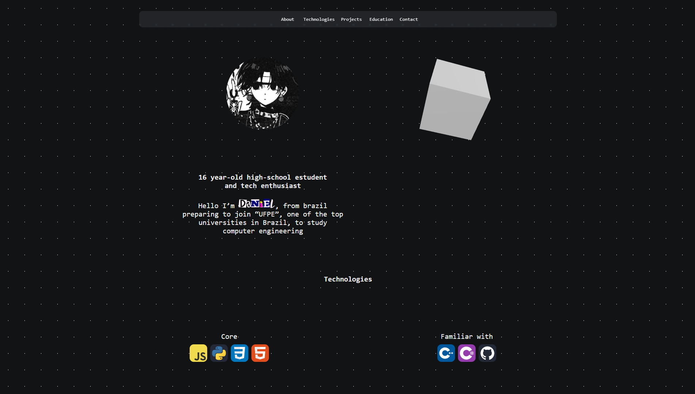

# Dan's Personal Website
My personal website and portfolio.

<!-- A GIF or screenshot of the site can be added here later. -->

## 🎯 Why?
I created this page to practice and learn more about Web Development, HTML, and CSS.

## 🛠️ Built with:
* **HTML5** - Page structure and elements 🧱
* **CSS3** - Styling, animations, and responsiveness 🎨
* **GitHub Pages** - Project hosting and deployment 🚀
